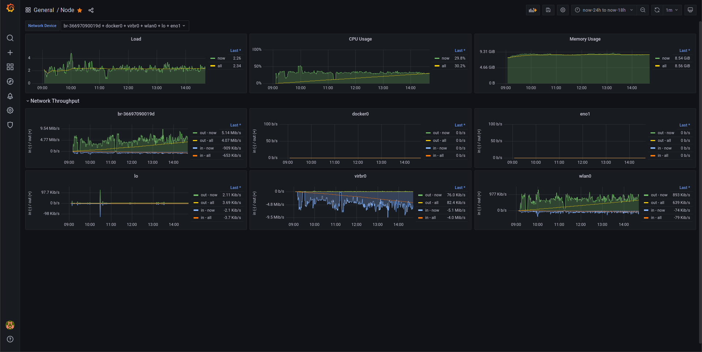
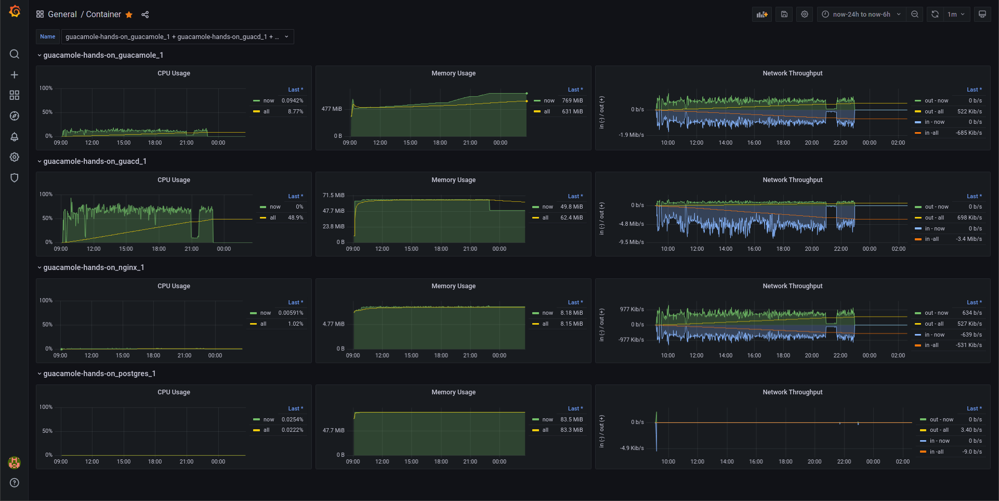

# Guacamole Hands-on

## Features

- Standalone **[Apache Guacamole](https://guacamole.apache.org/)** server
- Built-in reverse proxy using TLS 1.3 ([Nginx](https://nginx.org/) & [cfssl](https://cfssl.org/))
- Built-in monitoring ([Grafana](https://grafana.com/) & [Prometheus](https://prometheus.io/))
- Built-in database management ([Adminer](https://www.adminer.org/))

## Prerequisites

- Docker
- Docker Compose

## Getting started

Generate certificates and SQL.

```bash
$ docker-compose -f docker-compose.init.yml run --rm cfssl
$ docker-compose -f docker-compose.init.yml run --rm guacamole
```

Start all services.

```bash
$ docker-compose up
```

Then, you'll able to access following URLs.

- `https://localhost:5670/`: Apache Guacamole (redirection)
- `https://localhost:5670/adminer/`: Adminer
- `https://localhost:5670/cadvisor/`: cAdvisor
- `https://localhost:5670/grafana/`: Grafana
- `https://localhost:5670/guacamole/`: Apache Guacamole
- `https://localhost:5670/node-exporter/`: Node Exporter
- `https://localhost:5670/prometheus/`: Prometheus

## Screenshots





## References

- https://github.com/prometheus/node_exporter
- https://grafana.com/tutorials/run-grafana-behind-a-proxy/
- https://guacamole.apache.org/doc/gug/guacamole-docker.html
- https://guacamole.apache.org/doc/gug/proxying-guacamole.html
- https://kubernetes.io/docs/tasks/administer-cluster/certificates/
- https://prometheus.io/docs/guides/cadvisor/
